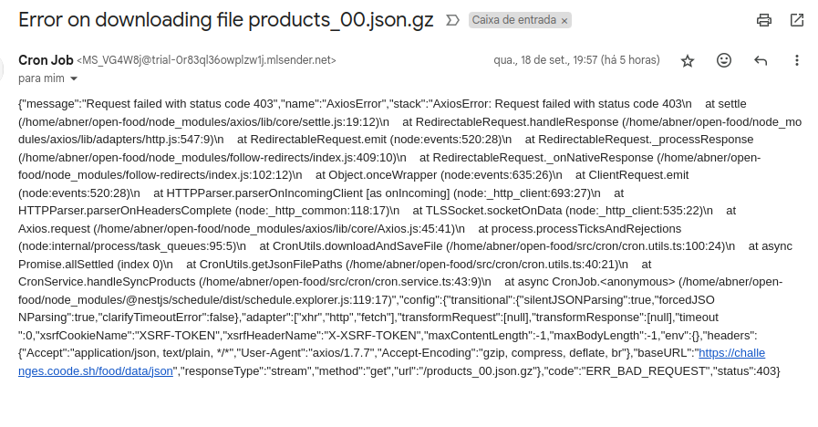

# Open Food

Sincrone e gerencie dados de produtos alimentares de forma eficiente e automatizada

This is a challenge by Coodesh

## Tecnologias e Ferramentas Utilizadas

- Linguagem: TypeScript
- Framework: NestJS
- Banco de Dados: MongoDB
- Containerização: Docker e Docker Compose
- Agendamento de Tarefas: Tarefas cron agendadas com @nestjs/schedule
- Gerenciamento de Dependências: npm

## Instruções de Uso

### Pré-requisitos

- Docker
- Docker Compose
- Node.js
- npm

### Instalação

1. Clone o repositório
2. Execute o comando `npm install` para instalar as dependências
3. Execute o comando `docker-compose up` para iniciar o banco de dados MongoDB

### Execução

Como estamos usando docker compose, não é necessário executar de forma manual.

### Testes

1. Execute o comando `npm run test` para rodar os testes unitários

### Documentação

1. Ao iniciar a aplicação, a documentação estará disponível em `http://localhost:3005/api`

### Extras realizados:

- [ ] Endpoint de busca com Elastic/Similar
- [x] Configuração do docker
- [x] Alerta de falha (email)
- [x] Documentação da API usando Open API 3.0
- [x] Testes unitários para GET/PUT/DELETE
- [x] API Key - autenticação [51d5c2e9-45ea-4756-b879-22ffeeed0c36]

### Processo de investigação + resolução

1. Início do projeto  

Desde o início até o final, fiz bastante consulta na documentação do [NestJS](https://docs.nestjs.com/)

Pra começar, foi decidido usar NestJS, a escolha do framework foi baseada na facilidade de uso e na estrutura de pastas
que ele fornece, o que facilita a organização do código.

Próximo foi entender de fato o que era necessário pra resolução da atividade.

Baseado no link: https://github.com/rodriguesabner/open-food/blob/master/products.json
Criei a DTO que definiria a estrutura dos arquivos a serem importados/atualizados.

2. Importação do arquivo, aqui levei um tempo considerável na tarefa.  

A princípio pensei em deixar tudo em memória, mas notei uma lentidão maior no processo, fora que ainda tinha que
realizar a descompactação do arquivo.

Decidi então armazenar dentro da pasta ./tmp. Primeiro realizo o download do zip (arquivos listados no link).
Depois descompacto, deleto o zip e processo o json.

Pensei também em deixar a CRON dentro de products.service, mas fugia totalmente da
responsabilidade do serviço. Criei então o cron.service para lidar com isso.

Quando realizei a descompactação do arquivo e fui realizar a leitura, me deparei com o problema de ler vários arquivos com 1gb+.

Então decidi ler o arquivo linha a linha, e quando chegasse na centésima linha, parar a leitura.
Depois de algumas -longas e falhas- tentativas de importar e converter o arquivo, percebi que tinham alguns dados que
estavam me complicando `(""\r)`", então decidi fazer um replace `chunk.replace(/[;\r]/g, '').replaceAll(/\\"/g, '');`.

Depois disso consegui andar mais rápido nas outras demandas do projeto.

3. Criação de endpoints  

Criei os endpoints solicitados + testes, sem complicações.

4. Configuração do Docker  

Fiz a configuração do Docker e Docker Compose, tive um pouco de dificuldade ao conectar com o banco em alguns momentos, mas parecia ser
algo da minha máquina.

5. Alerta de falha  

Fiz a configuração do envio de email, testei e funcionou.

